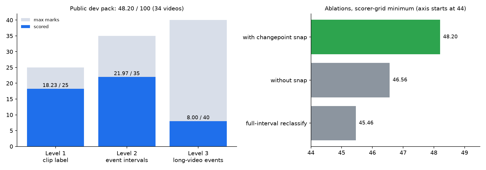
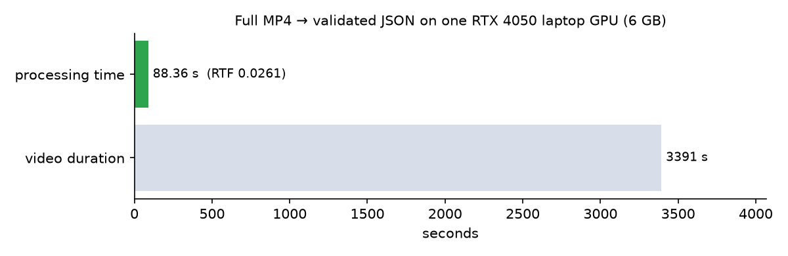

# Real-time video anomaly detection on a 6 GB laptop GPU

**AHC Visual Intelligence Hackathon.** The system watches traffic and CCTV footage and reports *what* went
wrong (11 anomaly classes: accident, fire, smoke, flood, wrong-way driving, fighting and more) and *when*
it happened, down to start and end times in videos up to 10 minutes long.

The competition rule shaped the whole design: **the detector has to run in real time on limited GPU hardware,
and hosted models are not allowed at runtime.** So there are no API calls to a large vision-language model.
A frozen SigLIP2 encoder and a ~0.4M-parameter trained head run locally and process an hour of video in
under a minute and a half.

**Project page:** https://ahc-video-anomaly.vercel.app

| | |
|---|---|
| **Dev-pack score** | **48.20 / 100** on the public 34-video pack (scorer-sensitivity grid: min 48.20, median 50.49, max 54.49) |
| **Speed** | **RTF 0.0261**: 3,391 s of video → validated submission in 88.4 s, about **38× faster than real time** |
| **Hardware** | One RTX 4050 laptop GPU (6 GB), fp16 |
| **Runtime dependencies** | None hosted. Encoder, head and explanations all run on the device |
| **Stack** | Python 3.12 · PyTorch · Hugging Face Transformers (SigLIP2) · OpenCV · NumPy / pandas · scikit-learn |

---

## The problem

| Level | Input | Required output | Weight |
|---|---|---|---|
| **1** | short clip (5–26 s) | one label for the whole clip, or "normal" (no timestamps) | 25 |
| **2** | ~4 min video | every anomaly event with class + start/end time | 35 |
| **3** | 5–11 min video | same as L2, and timing matters more | 40 |

An event counts only when the **class is right and temporal IoU ≥ 0.5**, matched greedily one-to-one.
On a normal video, predicting *anything* scores 0 for that video. Precision matters as much as recall.

## System architecture

```mermaid
flowchart LR
    A[MP4 files<br/>+ manifest.json] --> B[Decode & sample<br/>2 fps · OpenCV]
    B --> C[Frozen SigLIP2<br/>ViT-B/16 · fp16]
    C --> D[(Embedding cache<br/>.npz per video<br/>resumable)]
    D --> E{Level?}
    E -- "L1" --> F[ClipHead on the<br/>full clip]
    F --> G[argmax class,<br/>or no event if P(normal) wins]
    E -- "L2 / L3" --> H[ClipHead on 3 s windows<br/>1 s stride]
    H --> I[Threshold 0.4 →<br/>merge same-class windows]
    I --> J[1.25× centre expand →<br/>snap edges to embedding<br/>changepoints]
    G --> K[Template explanation<br/>deterministic, local]
    J --> K
    K --> L[Schema validator<br/>7 rejection rules]
    L --> M[submission.json]
```

### Components

| Module | Role |
|---|---|
| `ingest.py` | Pulls and verifies the dataset from any of 5 published mirrors (compares CSVs first, a few KB) |
| `features.py` | Decodes at 2 fps and embeds frames with a frozen encoder (`siglip2`, `clip_b16` or `dinov2`), writing a resumable `.npz` cache |
| `heads.py` | `ClipHead`: attention pooling over frames → 12-way classifier (11 classes + normal). Attention pooling rather than mean pooling, because an accident or fight lives in a few frames and averaging dilutes it |
| `train.py` | Trains heads on cached embeddings in minutes; inverse-√frequency class weights for the long tail |
| `fallback.py` | The production L2/L3 decoder: sliding windows, same-class merge, expansion, changepoint snap |
| `segment.py` | Embedding changepoints. Eval videos are spliced from trimmed clips, so real event edges sit on appearance changes |
| `explain.py` | Template explanations for the reasoning bonus. Deterministic, always 20–500 chars, never a network call |
| `scorer.py` | Local replica of the official metric, plus a sensitivity grid so tuning isn't overfit to one scorer reading |
| `validate.py` | Pre-flight check against every documented rejection cause, run before every upload |
| `predict.py` | Day-of entry point: manifest → cache → predictions → explanations → validated JSON |

### Design decisions

- **Freeze the encoder, train only the head.** A train → evaluate → change loop takes minutes, not hours,
  and the 6 GB card never has to hold gradients for a ViT.
- **Cache embeddings once.** Every experiment after the first reads `.npz` files instead of decoding
  13.9 GB of video again.
- **Tune against a grid, not one number.** Any change had to raise the *minimum* over the scorer-sensitivity
  grid before it shipped, so a single lucky reading couldn't justify it.
- **Hosted models are offline-only.** Larger models could be used to build training data or baselines under
  `tools/`, never inside `src/ahc/`. The API key isn't imported anywhere on the inference path.

## Results



- **Level 2 found 5 of 18 events.** On video T028 it matched all 4 events with IoUs 0.87, 0.67, 0.64 and 0.67.
- **Changepoint snapping helps:** removing it drops the grid minimum from 48.20 to 46.56 (−1.64), so it stays on.
- The numbers come from `python -m ahc.predict`, not a hand-edited submission.



The runtime figure covers decode, preprocessing, encoder inference, head inference and post-processing.
It excludes only model loading. Median time per video is 216.6 ms. The longest clip (T033, 629 s) took 20.1 s.

All numbers are in [`docs/results.json`](docs/results.json) and come from [`ARCHITECTURE.md`](ARCHITECTURE.md).
The charts are rendered by `tools/make_readme_charts.py`.

### What didn't work (and was not shipped)

| Experiment | Outcome | Decision |
|---|---|---|
| Conv/Transformer **temporal head** trained on synthetic spliced sequences | On held-out real long videos: precision 0.39 %, recall 5.8 %, false alarms on 39.3 % of normal videos | Rejected. It failed the transfer gate |
| **Full-interval reclassification** of merged windows | Grid minimum 45.46 (vs 48.20), still preferred wrong labels | Opt-in, disabled |
| 768-config **L3 search** (window 6–24 s, stride, threshold, expansion, gap bridging, caps) | Best config only reproduced 48.20 | No gain, not a tuning win |

**Main limitation:** Level 3 (8/40). Some L3 anomalies depend on *duration or context* (congestion that
builds up, a vehicle that stays too long), not on how any one window looks, so absolute appearance
thresholds miss them. The next experiment would be per-video robust normalisation of each class-score
curve. It would only ship if it beats the grid minimum.

## Output format

`predict.py` writes one entry per video (enforced in `src/ahc/types.py`):

```jsonc
{
  "predictions": [
    {
      "video_id": "E001",
      "events": [
        {
          "class_name": "traffic_accident",      // one of 11; normal is expressed as "events": []
          "start_time_sec": null,                // Level 1: always null
          "end_time_sec": null,
          "score": 0.0,                          // head confidence
          "explanation": "A collision between vehicles is visible throughout the clip."
        }
      ],
      "runtime_metadata": {
        "frames_processed": 0,
        "chunks_processed": 0,
        "end_to_end_internal_time_ms": 0.0
      }
    }
  ]
}
```

At Levels 2/3, `start_time_sec` and `end_time_sec` are required, and the explanation reads, for example,
*"Thick smoke observed from 42.0s to 57.5s."*

## Run it

Requires an NVIDIA GPU with CUDA and the competition dataset (not redistributed here).

```powershell
python -m venv .venv
.venv\Scripts\pip install -e . torch transformers opencv-python numpy pandas scikit-learn matplotlib

.venv\Scripts\python.exe -m ahc.features --split train --encoder siglip2   # build the embedding cache
.venv\Scripts\python.exe -m ahc.train clip                                 # train ClipHead (minutes)
.venv\Scripts\python.exe -m ahc.predict --manifest manifest.json --out runs/sub.json
.venv\Scripts\python.exe -m ahc.validate runs/sub.json --manifest manifest.json
```

All tunables live in `configs/default.yaml`, with no magic numbers in code. Update `paths.root` to your checkout.

## Repository layout

```
configs/default.yaml   every tunable (encoder, fps, windows, thresholds, training)
src/ahc/               the package (see Components above)
tools/                 offline-only helpers: preflight, template filler, README charts
docs/                  results.json + chart images
ARCHITECTURE.md        shipped system, measurements, rejected experiments
CODEX.md               implementation contracts and competition rules
tasks/BACKLOG.md       build order
```

## Why there is no live inference demo

The detector needs a CUDA GPU, the trained `ClipHead` checkpoint and the competition videos. None of these
can go on free hosting, and the dataset isn't mine to redistribute. The [project page](https://ahc-video-anomaly.vercel.app)
presents the architecture and measured results instead. Nothing on it is simulated.
